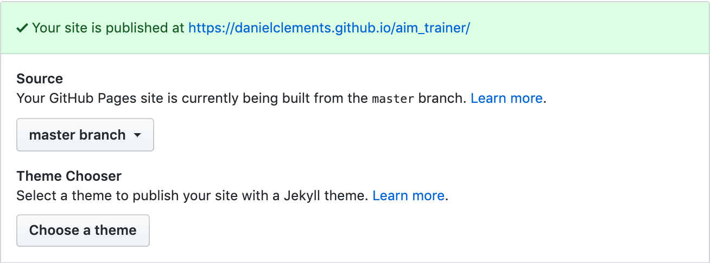
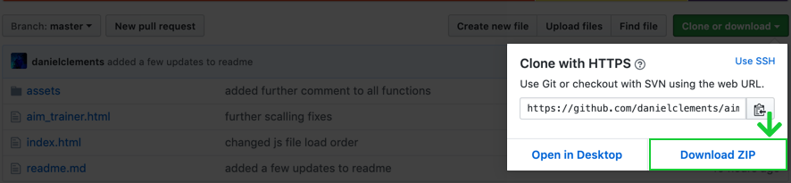
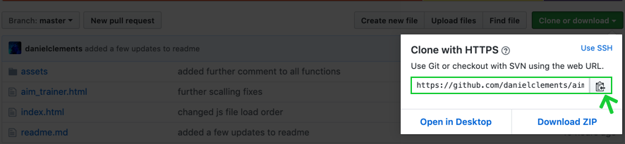

# Aim_Trainer

Aim_Trainer is my second milestone project as part of The Code Institute curriculum, This project idea came to me whilst playing csgo and realizing i needed to get better at aiming, so i thought to my self "What could be better than making my own aim training game!".

Click the targets that appear on screen , make sure your fast they wont wait around for ever !
The game will not only improve your reacion time but will help improve hand to eye coordination.

## Link to game   

Practise your aim : [Aim_Trainer](https://danielclements.github.io/aim_trainer/)

## UX
 
I tried to keep the UX for this project as simple as possible whilst still maintaining a good balance of information and visual/auditory feedback, the initial design was inspired by old arcade machines.

 - [Index]

    - The game starts by asking for a "User Name", once a user name is imputed the rest of the page is revealed. On the left we have a basic how to            play section, that details how to progress through the games difficulty settings and how to actually improve your aim and reaction time.

    - In the middle it shows a basic copy of the game so the user knows what to look out for when the actual game starts , this is removed on the mobile      view as it messed up the flow of the page.

    - On the right you can see the settings area, all settings are saved in a local storage item, the first time index is loaded it will set the default      settings as a local storage item, if cache is cleared at any point it will be reset on next page load.
   
- [Aim_trainer]

    - On the left of the aim_trainer page it displays the stats for the user, the stats update on every click/missed target. The stats do change design       depedning on the theme selected. 
    
    - In the middle of this page we have the game area, this is where all targets will spawn, once a target is succesfully clicked it will dissapear and spawn a new target , a max of 30 targets will spawn per game, after the final target dissapears a modal will load.

    - On the right you can see the same settings as the index page.

    - End Of Game Modal: Will display Player Name, Total Hits, Total Misses, Accuracy %.
      

the whole project was designed off a single wireframe i made using sketch, a lot of the time i was design/ building the project at the same time.

[Wireframes / Mockups!](https://github.com/danielclements/TJ-Dean-Portfolio/tree/master/Wireframes)

## Features

 
### Existing Features

- Difficulty selector : The user can select what difficulty they would like to play on depending on how good they think they are.

- Theme / Target selector: The user can chose between the default light theme or they can apply a light theme. Along with the theme the user can chose between fruit targets and alien targets.

- High Score: Each difficulty has its own built in high score local storage item, the high score stat will change / update depending on difficulty selected.

- Local Storage: This project uses local storage to save your existing settings, high scores and username.

### Features Left to Implement
- In the future I plan to add a alternate game mode that will focus on hitting as many tagets in a row as          possible. The aim of this mode will be to get the highest hit count possible , as soon as one target is missed   the game mode will end.

- I plan to add a global leader board that will persist user scores to promote competition amongst users.          MongoDB is a scalable, JavaScript friendly database which can be integrated into the current application. 

- In the future I plan on adding extra target icons that will unlock after you achieve a perfect score on any given difficulty. 

## Technologies Used

- [HTML 5](https://en.wikipedia.org/wiki/HTML5)
    - The project uses **HTML 5** to write the front end of the website.

- [CSS 3](https://en.wikipedia.org/wiki/Cascading_Style_Sheets)
    - This project uses **CSS 3** to style the front end of the website.

   
- [JavaScript](https://www.javascript.com/)
    - The project uses **JavaScript** to allow interactive development and the game logic is also creadted with in JS.
    
- [JQuery](https://jquery.com)
    - The project uses **JQuery** to improve dom manipulation and development speed with in javascript.  

- [Bootstrap 4](https://getbootstrap.com)
    - This project uses **Bootstrap** to improve scaling to mobile and decrease development time

- [Sketch](https://www.sketch.com/)
    - This project uses **Sketch** to create mockups / wireframes.

- [Font Awesome](https://fontawesome.com/)
    - this project uses font awesome to display a few icons in the title and the targets.

## Testing

In this section, you need to convince the assessor that you have conducted enough testing to legitimately believe that the site works well. Essentially, in this part you will want to go over all of your user stories from the UX section and ensure that they all work as intended, with the project providing an easy and straightforward way for the users to achieve their goals.

## Bugs

- Intro music on index page and battle music on aim_trainer dont always play when the page is loaded.

## Deployment

This site is hosted on github pages.The page is being hosted directly from the master branch, that way any updates that are committed will be updated straight away.  
By using the file name `index.html` github pages knows what file to display as the main page, with out this you GP wont know what to display.

### Running Code locally:

1. Using Download:
    1. Navigate to `https://github.com/danielclements/aim_trainer`.
    2. Click the green button that says "Clone or Download".
    3. Click download zip.
    4. Extract zip file.
    5. Import in to preferred IDE.

2. Using Git Clone:
    1. Open terminal in preferred IDE.
    2. Type "git clone https://github.com/danielclements/aim_trainer"

## Credits
 [RGB Border annimation by @Huhtamaki on Code Pen](https://codepen.io/Huhtamaki/pen/GPzwPY)

 [Set interval Timer by @jfriend00 on StackOverFlow](https://stackoverflow.com/questions/8126466/how-do-i-reset-the-setinterval-timer)

### Content
- The text for section Y was copied from the [Wikipedia article Z](https://en.wikipedia.org/wiki/Z)

### Media
- [Successful Hit Sound](https://freesound.org/)

- [Index Intro By @Tristan Lohengrin](https://www.tristanlohengrin.com/)

- [Alien Targets by @Surt on](https://opengameart.org/content/modular-reticulan-portraits )

- [Battle music was made by @Jonathan SO](https://jonathan-so.itch.io/creatorpack)

- I used [This Video!](https://www.youtube.com/watch?v=k8yJCeuP6I8) to figure out how to use the local storage methodes in JavaScript.

### Acknowledgements

- I received inspiration for this project from a old aim map in the popular FPS game Counter Strike, the map I used to train on was called [training_aim_csgo2](https://steamcommunity.com/sharedfiles/filedetails/?id=213240871) and was made by users @_katas and @cardboard on Steam.

- Code to refresh the page on click was created by [TutorialRepublic](https://www.tutorialrepublic.com/faq/how-to-refresh-a-page-with-jquery.php).

- [Iphone SE Media Query](https://stackoverflow.com/questions/12539697/iphone-5-css-media-query)

- I used [Masterting Markdown](https://guides.github.com/features/mastering-markdown/) to help write the readMe file.